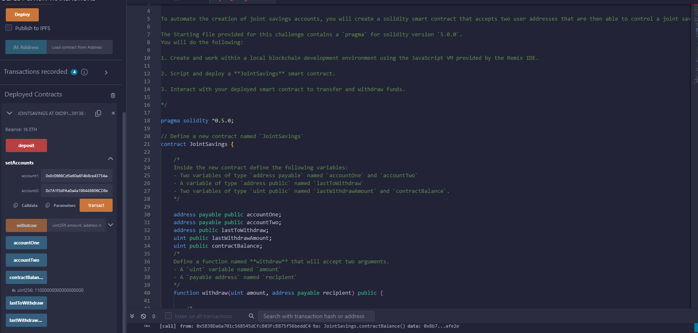

# Unit-20-Homework

The smart contract has been compiled & Deployed successfully.

Test the deposit functionality of your smart contract by sending the following amounts of ether. After each transaction, use the `contractBalance` function to verify that the funds were added to your contract:

    * Transaction 1: Send 1 ether as wei.

    * Transaction 2: Send 10 ether as wei.

    * Transaction 3: Send 5 ether.

 

